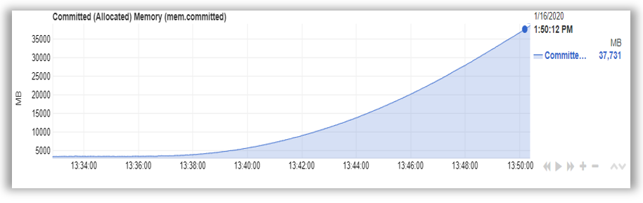

# MemoryLeaker

 A utility that simulates a memory leak for testing and diagnostic purposes.

 

## Download

- **Windows x64:** [memoryleaker.exe](https://github.com/robert-mcdermott/memoryleaker/blob/master/bin/memoryleaker.exe?raw=true)
- **Linux   x64:** [memoryleaker](https://github.com/robert-mcdermott/memoryleaker/blob/master/bin/memoryleaker?raw=true)

## Usage

Executed without providing a leak delay it will default to 100ms which leaks at a rate of about 200MiB the first minute (it's not linear). You can adjust the delay to control rate of the leak from ~3GiB/persecond with no delay (-d 0) or to ~3MiB/minute with 1000ms delay (-d 1000), or a very, very slow leak with a 10 second delay (-d 10000).

Once it's started it will run until stopped (ctrl-c), otherwise it will leak until your system out of memory. If you'd like to define an upper limit to the memory leak, you can use the limit flag (-l \<limit in MiBs\>) that will stop the leak once the desired limit is reached.

```
./memoryleaker [-d <leak delay in ms; deafaults to 100>]
 
  -d int    Optional: delay in ms to adjust the leak rate; default is 100

  -l int    Optional: upper limit to the memeory leak in MiB; default is unlimited
 
  -h        print usage information
```

## Examples

Default mode with 100ms leak delay:

```
$ ./memoryleaker 
Leaked: 3 MiB ███████▒▒▒
```

Here's a very fast memory leak that's lmited to 2GB:

```
$ ./memoryleaker -d 5 -l 2048
Leaked: 2048 MiB ███████▒▒▒ 
Holding at 2048 MiB 
```
